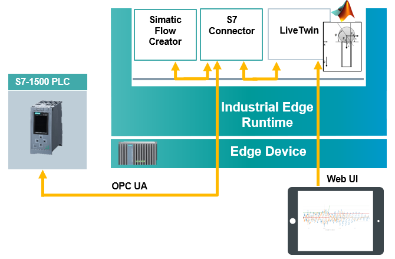

# Simulating virtual sensor with LiveTwin

Running a simulation model on a Industrial Edge Device using the Siemens app LiveTwin. 

- [Simulating virtual sensor with LiveTwin](#simulating-virtual-sensor-with-livetwin)
  - [Description](#description)
    - [Overview](#overview)
    - [General task](#general-task)
  - [Requirements](#requirements)
    - [Prerequisities](#prerequisities)
    - [Used components](#used-components)
  - [Installation steps](#installation-steps)
  - [Documentation](#documentation)
  - [Contribution](#contribution)
  - [Licence & Legal Information](#licence--legal-information)

## Description

###  Overview
This application example shows how to export Simulink virtual sensor model and run it on a Industrial Edge Device with LiveTwin edge application. The model can read data from PLC and send the current status back to the PLC. 

### General task
The main goal of this automation task is to create Simulink model that simulates shock sensor, export it in the required format and run it on the Industrial Edge Device using LiveTwin. The edge device can read data from PLC simulating vibrations via integrated S7 Connector using S7 communication protocol. Based on logic in the SIMATIC Flow Creator, the model can evaluate whether the vibrations have occurred and send the current shock status back to PLC. The data flow can be visualized directly in LiveTwin. 

## Requirements

###  Prerequisities

- Onboarded Industrial Edge Device on Industrial Edge Management
- Installed system configurators
- Installed system applications
- Installed LiveTwin and SIMATIC Flow Creator applications
- Edge device is connected to PLC 
- TIA portal project downloaded to PLC ([TIA project](src/Shock_detection1500.zip))

### Used components

- Industrial Edge Device V 1.2.0-56
- PLC: CPU 1511
- TIA Portal V16 
- Matlab 2019b
- SIMATIC S7 Connector V 1.2.26 
- SIMATIC S7 Connector Configurator V 1.2.32
- IE Databus V 1.2.32
- IE Databus Configurator V 1.1.23
- SIMATIC Flow Creator V 1.0.5
- LiveTwin V1.0.5

## Installation steps
You can find the further information about the following steps in the [Installation](docs/Installation.md) documentation
- Export Simulink model 
- Import the model to LiveTwin  
  - Create instance
  - Create LiveTwin project
- Configure the LiveTwin project properties
- Configure IE Databus 
- Configure SIMATIC S7 Connector 
- Run the simulation 
  - Visualize the data 
  - Send shock status back to PLC

## Documentation
- Here is a link to the [docs](docs/) of this application example.
- You can find further documentation and help in the following links
  - [Industrial Edge Hub](https://iehub.eu1.edge.siemens.cloud/#/documentation)
  - [Industrial Edge Forum](https://www.siemens.com/industrial-edge-forum)
  - [Industrial Edge landing page](https://new.siemens.com/global/en/products/automation/topic-areas/industrial-edge/simatic-edge.html)
  
## Contribution
Thanks for your interest in contributing. Anybody is free to report bugs, unclear documenation, and other problems regarding this repository in the Issues section or, even better, is free to propose any changes to this repository using Merge Requests.

## Licence & Legal Information
Please read the [Legal information](LICENSE.md)
