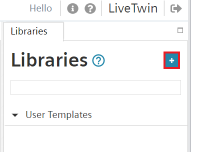
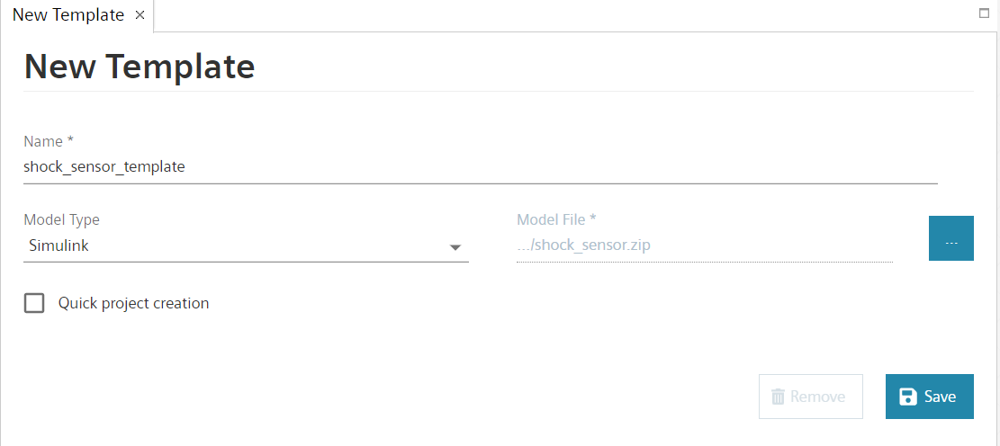
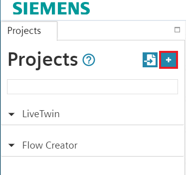
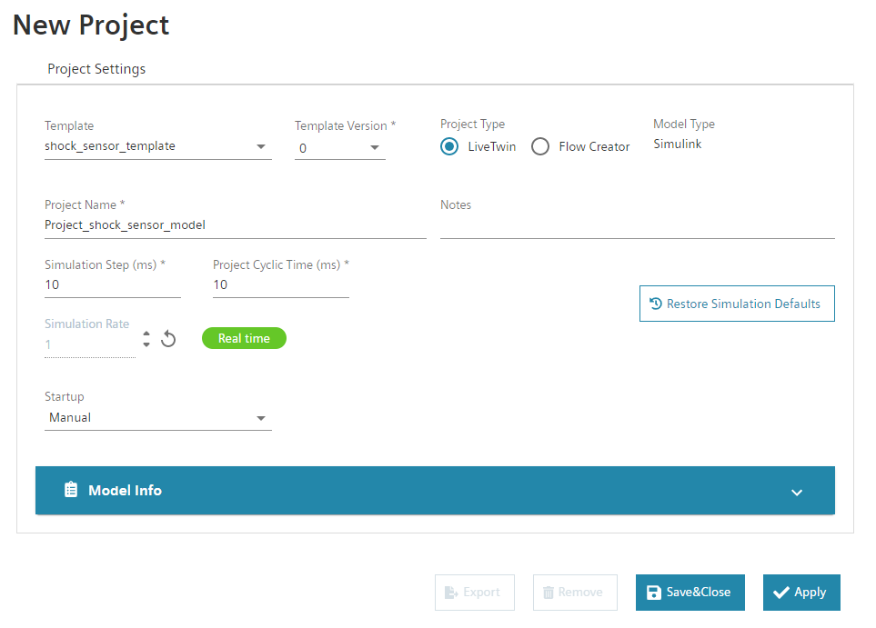
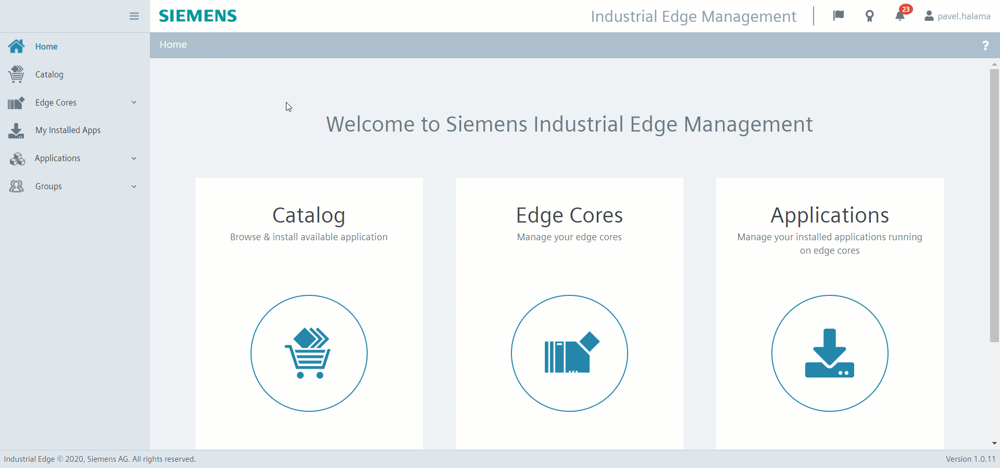
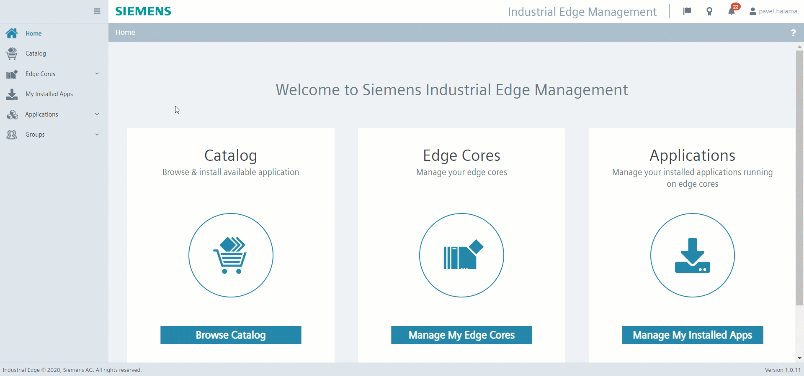
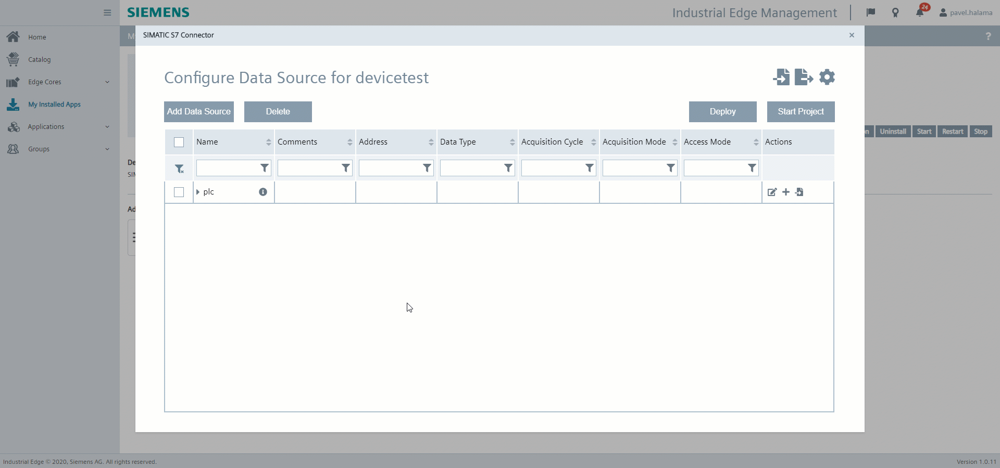
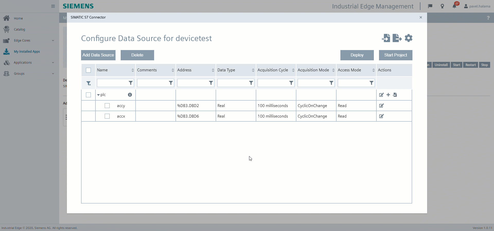
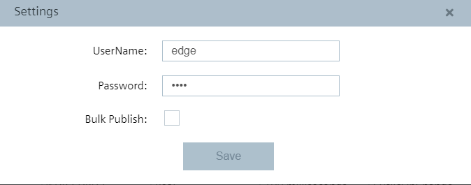

# LiveTwin application example 

- [LiveTwin application example](#livetwin-application-example)
  * [Configure PLC project](#configure-plc-project)
  * [Export Simulink model](#export-simulink-model)
  * [Import the model to LiveTwin](#import-the-model-to-livetwin)
    + [Create template](#create-template)
    + [Create LiveTwin project](#create-livetwin-project)
  * [Simulation configuration](#simulation-configuration)
    + [IE Databus configuration](#ie-databus-configuration)
    + [SIMATIC S7 Connector configuration](#simatic-s7-connector-configuration)
    + [LiveTwin project configuration](#livetwin-project-configuration)
    + [SIMATIC Flow Creator configuration](#simatic-flow-creator-configuration)

## Configure PLC project
1) Open TIA portal and open the project: [TIA project](../src/Shock_detection1500.zip). 

2) Download the PLC program to PLC (It is also possible to use PLCSIM advance).

3) (Optional) Feel free to simulate and configure provided HMI (*HMI_TP700/Screens/Applications/51_LiveTwin*) to control the PLC program. 
  


## Export Simulink model 

*Note: Matlab 2019b is used in this example*

If you are interested in exporting your own Simulink model, the documentation can be found here: [documentation](export_simulink_model.md)

The Simulink model for this use case is already in this repository: [Shock-sensor-model](../src/shock_sensor.zip)

## Import the model to LiveTwin 

*Prerequisities:*
 - *LiveTwin and SIMATIC Flow Creator applications are running on the Industrial Edge Device*


### Create template
1) Open LiveTwin UI and go to the "LiveTwin studio" section located in the left main menu.

2) Go to the Libraries are and click on the "plus" button to add a template. New tab pop up in the working area. 



3) Navigate to the "New Template" area and fill the form: 
 ```txt
  - Choose a "Name" for your template
  - Select the "Model Type" (in this case Simulink)
  - Browse in the "Model File" for the exported .zip file of the Simulink project. 

  ```
You can find Simulink project here: [livetwin template](../src/shock_sensor.zip)



4) Click "Save". The new template is generated. 

### Create LiveTwin project 

1) Go to the "Projects" section in the "LiveTwin studio" menu and click on the "plus" button to add project. 
   


2) Navigate to the "Projects" area and fill the following information: 
 ```txt
  - Select your "Template"
  - Select "LiveTwin" as a "Project Type"
  - Give the project a name 
  - Choose "Simulation Step" and "Project Cyclic Time" based on your requirements
  ```



3) Click "Save&Close". The new LiveTwin project is created. 

## Simulation configuration

In order to finish this automation task, we need to read/write data from/to PLC. In this use case, we will use SIMATIC S7 Connector system application to establish connection with PLC using S7 and OPC comunnication protocols. The SIMATIC S7 Connector is also connected to the IE Databus and LiveTwin can then access the data from IE Databus via the MQTT protocol. In order to establish this infrastructure, follow these instructions: 


### IE Databus configuration
1) Go to the "My Installed Apps" section of the Industrial Edge Management System. 
2) Click on the "IE Databus" application icon. 
3) Click on the "Update Configuration" button, new configuration file appears. 
4) Select you edge device and click on "Launch Configurator", IE Databus Configuration window appears. 


5) Configure the following information: 
 ```txt
   User name: edge 
   Password: edge 
   Topic: ie/# 
   Permission: Publish and Subscribe
   ```


### SIMATIC S7 Connector configuration
For performance purposes, we will use the S7 communication protocol for high frequency data simulating vibrations and OPC UA protocol for low frequency data. In order to establish connection with the PLC, follow these instructions: 

1) Go to the "My Installed Apps" section of the Industrial Edge Management System. 
2) Click on the "SIMATIC S7 Connector" application icon. 
3) Click on the "Update Configuration" button, new configuration file appears.
4) Click on "Add Data Source" button, select "Simatic S7 protocol" and provide following information for this data source: 
  ```txt
    Name : plc                           
    IP Adress: IP of PLC, for example 192.168.80.20
    PLC Type: 1200/1500
  ```
   


5) Click the "plus" button on the right side of the data source to add a tag and input: 
- Acceleration in direction y: 
  ```txt
    Name : accy                             
    Adress: %DB3.DBD2
    Data Type: Real
    Acquisition Cycle: 10 ms
    Acquisition Mode: CyclicOnChange
    Access Mode: Read
  ```

- Acceleration in direction x: 
  ```txt
    Name : accx                      
    Adress: %DB3.DBD6
    Data Type: Real
    Acquisition Cycle: 10 ms
    Acquisition Mode: CyclicOnChange
    Access Mode: Read
  ```


6) Click on "Add Data Source", select OPC-UA and fill the following information: 
   
```txt
    Name : plcshock                           
    OPC-UA URL: opc.tcp://192.168.80.20
    Port Number: 4840
    Messaging Mode: None 
    Authentication Mode: Anonymous
```

7) Click on the file icon on the right side of the data source to enable the "browse" function for tags. 

8) Select "HMIHandleDB_resetShock" tag and configure the tag with these information: 
  
```txt
    Data Type: Real
    Acquisition Cycle: 1 s
    Acquisition Mode: CyclicOnChange
    Access Mode: Read & Write
```



9) Go to the "Settings" option in the right top corner and fill the databus properties: 

  ```txt
    UserName: edge 
    Password: edge
    Bulk publish: Disabled!
  ```

  


10) Click "Deploy" and then "Start Project" buttons.


### LiveTwin project configuration

1) Go to LiveTwin instance settings. The new configuration window opens. 

2) For the input signals configure: 
- Accelx:
    
  ```txt
    Data Source: plc 
    Tag Name: accx
  ```
- Accely:
    
  ```txt
    Data Source: plc 
    Tag Name: accy
  ```

3) Go to the "Server Settings" (connection to IE Databus) and insert the Databus properties: 
   
  ```txt
    Username: edge
    Password: edge
    Output topic: ie/status
  ```
Uncheck the "Bulk publish" option!

*Note: The output topic will be used in Flow Creator*

4) Click "Save&Close". 


### SIMATIC Flow Creator configuration
In order to send the shock status back to the PLC we have to create some logic to evaulate whether the shock has been detected or not. We can use the SIMATIC Flow Creator application to do that. 

1) Open user interface of the SIMATIC Flow Creator application.

2) Import the [flow.json](../src/flows.json) Flow Creator project. 

3) Deploy the application. 


## Run simulation
To run the simulation follow these instructions:

- Make sure that PLC is connected to the Industrial Edge Device and TIA project is downloaded and running on the PLC
- LiveTwin project settings are configured
- SIMATIC S7 Connector and IE Databus system applications are configured 
- SIMATIC Flow Creator project is deployed 
- Start the simulation of the LiveTwin project 
- Enable vibrations on the PLC ("HMIHandleDB" -> "enableVib" -> "True")
- Access the dashboard in the LiveTwin UI
- The shock status is send back to PLC. If a shock was detected, the value of the tag "HMIHandleDB" -> "resetShock" is set to 1.


